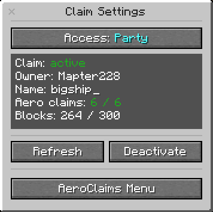
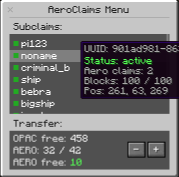

# Aeronautics Claims

Sub-level claim system for Create: Aeronautics.

## Compatibility

Works with:

* Open Parties and Claims (OPAC)
* FTB Chunks / FTB Teams

## About

Aeronautics Claims provides a custom claim system for Create: Aeronautics sub-levels.

The mod is separate from OPAC and FTB Chunks, but integrates with them to synchronize ownership and permissions between regular claims and Aeronautics sub-level claims.

